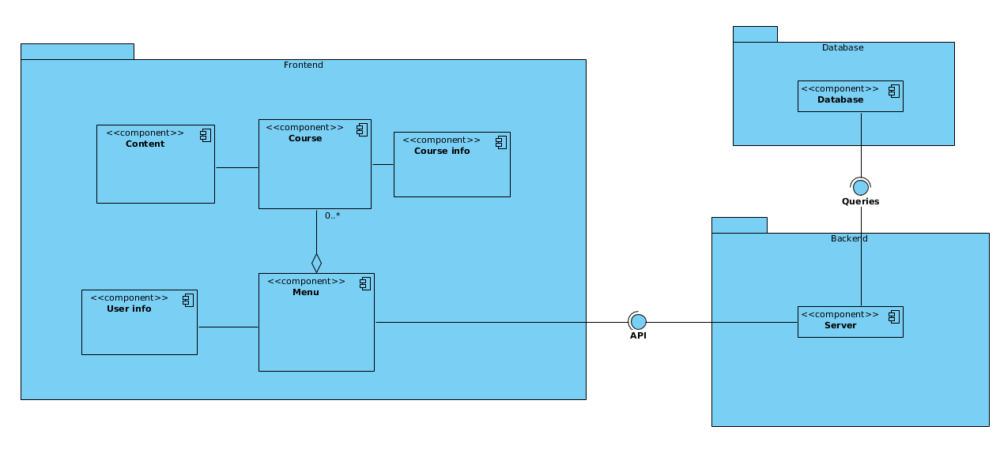
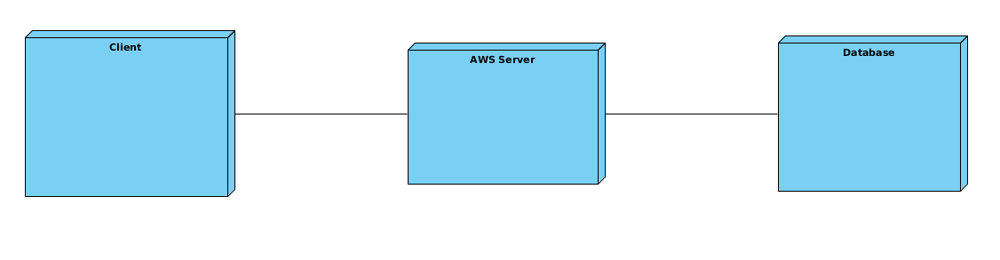

# Iteration 1

## Step 2: Iteration Goal and Select Drivers

The goal of this iteration is to define the overall system

Our drivers for this iteration are:

* QA-3
* CON-1
* CON-2

## Step 3: Elements to Decompose

The element to refine in this case, is the entire system since this a greenfield development.

## Step 4: Design Concept

| Design Decisions | Rationale                                                                                                                                           |
| ---------------- | --------------------------------------------------------------------------------------------------------------------------------------------------- |
| Web Application  | To support CON-1, we are implementing this as a web application |
| Deploy using AWS | We will be deploying this application  using cloud computing software, primarily AWS. This also helps support CON-2 since we are able to pay for more EC2 instances if servers become overloaded   **Discarded Alternatives**: Hosting the application ourselves was not an ideal task since it is usually more costly due to maintainance. The scalability offered through cloud computing was considered as more important than a locally hosted server |
| Three-Tier Architecture Pattern | For many web applications, it is beneficial to use this style of architecture since it increases performance time. We will be retrieving a lot of the information from the database, so using a design that helps support the quick access of data |
| Server Framework | We will be using Go Language, also known as Go or GoLang since the team is familiar with the framework. Go also has built in support for concurrent processes without the need to create new threads, also known as Goroutines  **Discarded Alternatives**: Hosting it via Node.js or Django were also possible alternatives, but were discarded due to Go's ability to create Goroutines |
| Relational Database | We will PostgreSQL as our DBMS since it is powerful and efficient. We can use it to keep track of the individual's courses. Using this, we can also archive old courses if needed, or remove the students from the courses once the semester has completed. |

## Step 5: Instantiate Architectural Elements, Allocate Responsibilities, and Define Interfaces

| Design Decision | Rationale |
| --------------- | --------- |
| Have a dedicated storage for course content | Using AWS S3, we can create a dedicated media storage that can be organized and have a high capacity. This is important since we can increase the access time  |

## Step 6: Sketch Design Decisions

A component digram that depicts the main components of the CMS

Deployment Diagram that depicts the 3 layers

## Step 7: Update Kanban